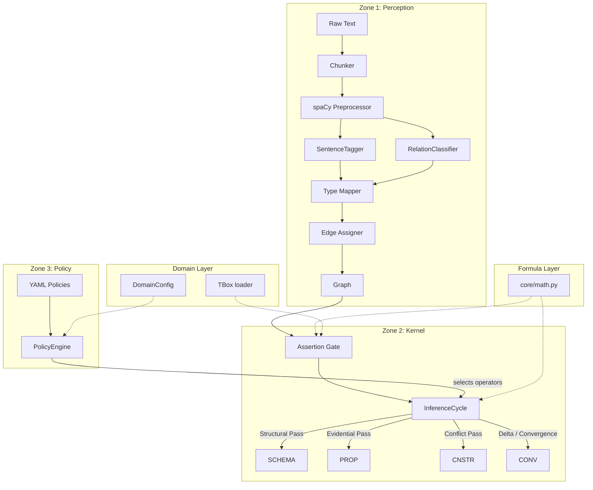

# Architecture

The engine is organized into three zones, a formula layer, and a domain layer:

```
cognitive_engine/
│
├── core/                    # Formula layer (zero imports from other modules)
│   ├── math.py              # All formal formulas: SL, Bayes, GNN, convergence, ...
│   ├── models.py            # Data models: Graph, Node, Edge, Opinion, ...
│   ├── state.py             # State dataclass with trace, metadata, abox, tbox
│   └── trace.py             # StateDelta and TraceBuffer for cycle recording
│
├── nlp/                     # Zone 1: Perception — NLP extraction
│   ├── chunker.py           # Sliding-window text chunking (RoBERTa tokenizer)
│   ├── preprocessor.py      # spaCy pipeline + coreference resolution
│   ├── tagger.py            # SentenceTagger + RelationClassifier (DistilRoBERTa)
│   ├── heuristic_classifier.py  # Rule-based fallback classifier
│   └── deposition_parser.py # Deposition Q/A structure parser
│
├── extract/                 # Zone 1: Perception — graph construction
│   ├── entities.py          # Entity extraction
│   ├── relations.py         # Relation extraction
│   ├── edges.py             # Edge assignment + causal inference
│   ├── types.py             # NodeType mapping + demarcation
│   └── demarcation.py       # 5 cognitive-linguistic dimensions
│
├── perception/              # Zone 1: Perception — hypothesis generation
│   └── hypothesis_generator.py  # NLI-based candidate missing links
│
├── kernel/                  # Zone 2: Kernel — reasoning governor
│   ├── assertion_gate.py    # Hard boundary: type check → opinion → invariant
│   └── inference_cycle.py   # 9-step loop: structural → evidential → conflict
│
├── policy/                  # Zone 3: Policy — operator selection
│   ├── schema.py            # WhenCondition, ThenAction, PolicyRule, OperatorPolicy
│   ├── builtin.py           # Default, legal, scientific policies
│   └── engine.py            # PolicyEngine: evaluate, select, YAML load
│
├── tbox/                    # Domain TBox — type hierarchies and axioms
│   ├── loader.py            # TBox dataclass, GENERAL_TBOX, load_tbox()
│   └── legal.py             # LEGAL_TBOX with legal-specific types
│
├── operators/               # Reasoning operators (Zone 2 + 3)
│   ├── extract.py           # Text → Graph (inlines the extraction pipeline)
│   ├── propagate.py         # Belief propagation via Master Equation
│   ├── constraint.py        # Constraint violation detection
│   ├── plan.py              # Policy-based operator sequence planning
│   ├── simulate.py          # What-if graph modification + re-propagation
│   └── ...                  # abduce, induce, analogy, debate, compare, etc.
│
├── memory/                  # Short-term / long-term memory
│   ├── store.py             # SQLite-backed graph storage
│   ├── retrieval.py         # Similarity-based retrieval (Jaccard + count proximity)
│   └── consolidate.py        # STM → LTM consolidation
│
├── reason/                  # Reasoning utilities
│   ├── sl_operators.py      # Subjective Logic operators
│   ├── fusion.py            # Opinion fusion strategies
│   ├── modes.py             # Reasoning mode definitions
│   ├── mode_operators.py    # Mode-specific graph transforms
│   ├── evidence.py          # CorpusResult, opinion_from_counts
│   └── validators.py        # Graph validation
│
├── domain.py                # Domain configuration framework (contextvars)
├── domains/
│   └── legal.py             # LegalDomainConfig and coefficients
└── schemas/                  # Domain schemas (legal, research, debate)
```

## Data Flow



## Three-Zone Design

### Zone 1: Perception
Converts raw text to a structured graph. Every output passes through the **Assertion Gate** before entering the reasoning kernel. No raw probabilities or embeddings reach Zone 2.

### Zone 2: Kernel
Runs the **InferenceCycle** — a 9-step iterative loop:
1. Extract (idempotent)
2. Structural pass (schema, graph, constraint)
3. Policy evaluation
4. Evidential pass (propagate, abduce, induce)
5. Conflict pass (debate, verify, constraint)
6. State delta computation
7. Memory consolidation
8. Convergence check (‖Δs‖ < ε)
9. Tick

### Zone 3: Policy
Declarative YAML policies define which operators run and in what order, based on state conditions. Replaces the old NeuralProgrammer heuristic controller.

## Determinism

Every stage is deterministic given the same input. No random seeds, no LLM calls, no API dependencies. UUID generation for node/edge IDs is the only non-deterministic operation (and does not affect reasoning outcomes).
