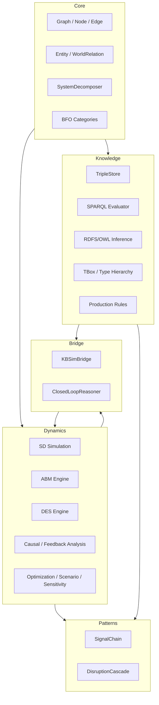

# Architecture

## Pillars



## Module Dependency Flow

```
core/  →  dynamics/   (models → SD/ABM/DES)
core/  →  knowledge/  (models → RDF triple store)
dynamics/ + knowledge/  →  bridge/   (KB↔simulation glue)
dynamics/ + knowledge/  →  patterns/ (reusable model factories)
```

## Dynamics Pillar (`dynafx/dynamics`)

- **DSL** (`dsl.py`, `_parser.py`) — Vensim-like `.sysd` models: stocks, flows, auxes, lookup tables, submodels, includes. Full arithmetic, comparisons, delays (SMOOTH, DELAY3, DELAYN, DELAY_FIXED), time functions (PULSE, STEP, RAMP, NOISE), CSV import.
- **Solvers** (`equations.py`) — RK4 and Euler integration.
- **ABM** (`agent.py`) — typed agents, rule-based behavior, message passing (`SEND`), strategy switching (`SWITCH_STRATEGY`), meta-rules, 4-phase step cycle.
- **DES** (`des.py`) — queues with capacity/service-time expressions, multi-server departure, resource pools, utilization tracking.
- **Causal** (`causal.py`) — `causes_tree`, `effects_tree`, `causal_trace`, `causes_strip`.
- **Feedback** (`feedback.py`) — `detect_feedback_loops`, `loops_for_variable`.
- **Optimization** (`optimization.py`) — `lp_minimize`/`lp_maximize` (scipy linprog), `pareto_optimize`, `calibrate`, and KB-constrained variants (`kb_lp_minimize`, `kb_calibrate`) that read coefficients/bounds from SPARQL.
- **Scenario** (`scenario.py`) — `ScenarioComparison` with comparison/deviation/tornado/summary tables, KB-graded ranking.
- **Sensitivity** (`sensitivity.py`) — uniform/normal/lognormal ensemble analysis.
- **Units** (`units.py`) — `~Unit~`-annotated stock/flow/aux units with propagation checking.
- **Emergent** (`emergent.py`) — `EmergentProperty`, `Condition`, `Effect`, consistency checks.

## Knowledge Pillar (`dynafx/knowledge`)

- **Model** (`model.py`) — RDF data model: `RDFNode`, `NamedNode`, `BlankNode`, `Literal`, `Triple`, `TriplePattern`, XSD types.
- **Store** (`store.py`) — `TripleStore` with SPO/POS/OSP nested indices, named graphs, graph isolation/copy/removal.
- **Turtle** (`turtle.py`) — Turtle/N-Triples tokenizer, recursive-descent parser, serializer.
- **SPARQL** (`sparql.py`, `_sparql_parser.py`) — SPARQL 1.1 parser/evaluator: SELECT, FILTER, DISTINCT, LIMIT, OFFSET; ASK, SELECT, DESCRIBE.
- **Inference** (`inference.py`) — forward-chaining `RuleEngine` with `rdfs_rules()` (7 rules) and `owl_rl_rules()` (4 rules).
- **TBox** (`hierarchy.py`, `loader.py`) — OWL2-style `TypeHierarchy`, `TypeNode`, `TBox`, `load_tbox`, `MDM_TYPE_HIERARCHY`.
- **Production** (`production.py`) — `ProductionRuleEngine`, 5 condition types, 5 action types, fire-once/priority.
- **CSV ingestion** (`ingest_csv.py`) — declarative CSV→RDF via YAML mapping files, lenient-by-default with strict opt-in.
- **Transactions** (`transactions.py`) — append-only temporal log backed by RDF.
- **Execution** (`execution.py`) — provenance-tracked action records.

## Bridge (`bridge.py`)

- **`KBSimBridge`** — three integration patterns:
  1. *Pre-flight*: `params_from_kb(claim_map)` extracts KB facts into simulation params.
  2. *Mid-flight*: `KB_QUERY`/`KB_ASSERT` builtins read/write the store each timestep.
  3. *Post-flight*: `evidence_from_result(...)` writes simulation results back as evidence triples.
- **`ClosedLoopReasoner`** — multi-pass simulate → grade → nudge → re-simulate.
- **`grade_queries`** — grade SPARQL query results by confidence.

## Patterns (`dynafx/patterns`)

- **`SignalChain`** — factory building a `SysdModel` for leading-indicator → outcome.
- **`DisruptionCascade`** — supply-chain disruption propagation model.

## Key Design Decisions

- **CompiledSystem caching**: ASTs, code objects, and topo-sort are cached after first `simulate()`, reused for all subsequent calls (~25x speedup).
- **Named graphs per source**: each information source is its own named graph; queries read across the union.
- **Lenient error handling by default**: `ingest_csv(strict=False)` logs warnings for bad rows; `strict=True` for test/validation.
- **No external connectors**: all enterprise data is generated programmatically in Python (no ERP/IoT/weather APIs).
- **SPARQL aggregate pre-computation**: the evaluator has no GROUP BY, so aggregate values are computed at data-generation time and stored as explicit triples.
- **Cross-stock flows need aux intermediates**: flows defined on one stock aren't visible to others at parse time.
- **Expression parser has no string literals**: SPARQL strings for `KB_QUERY` are passed as Python params.
- **Plotly for interactive charts**: single-file self-contained HTML output (no server required).
