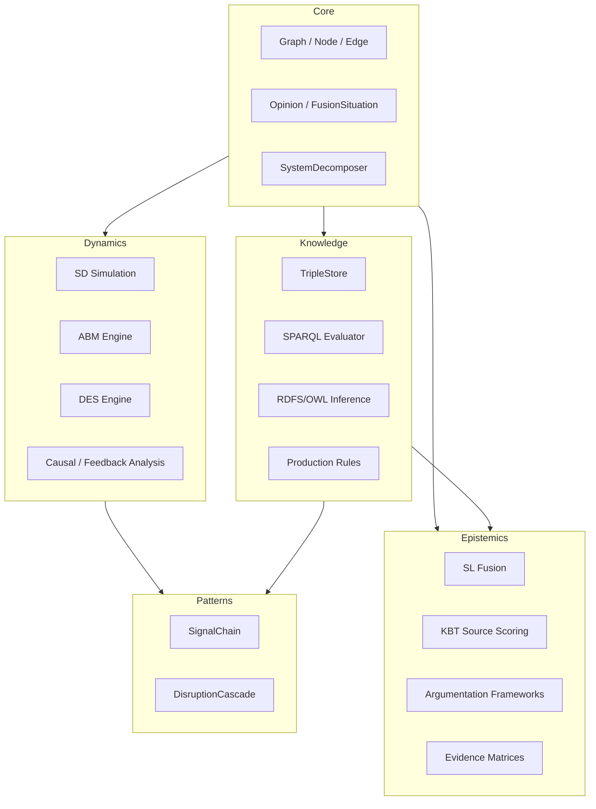

# Architecture

## Four Pillars



## Module Dependency Flow

```
core/  →  dynamics/   (Graph/Opinion → SD/ABM/DES models)
core/  →  knowledge/  (Graph/Opinion → TripleStore/RDF models)
core/  →  epistemics/ (Graph/Opinion → fusion/argumentation)
knowledge/  →  epistemics/  (triples → evidence/fusion)
dynamics/ + knowledge/  →  patterns/  (SD + KB → recipes)
```

## Key Design Decisions

- **CompiledSystem caching**: ASTs, code objects, and topo-sort are cached after first `simulate()`, reused for all subsequent calls (~25x speedup).
- **Named graphs per source**: Each information source in the KB is a named graph; fusion merges across graphs via SL consensus.
- **Lenient error handling by default**: `ingest_csv(strict=False)` logs warnings for bad rows; `strict=True` for test/validation.
- **No external connectors**: All enterprise data generated programmatically in Python (no ERP/IoT/weather APIs).
- **Plotly for interactive charts**: Single-file self-contained HTML output (no server required).
