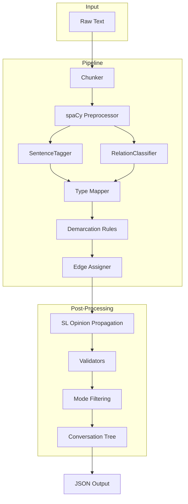

# Architecture

The engine is a deterministic, modular pipeline that transforms raw text into a formally-verified reasoning graph. There are no LLM calls — every stage is either a rule-based Python function or a small transformer model.

## Data Flow



## Component Overview

| Stage | Module | Description |
|-------|--------|-------------|
| Chunking | `chunker.py` | Splits text into overlapping 512-token windows using a DistilRoBERTa tokenizer |
| Preprocessing | `preprocessor.py` | Runs spaCy `en_core_web_trf` on each chunk; extracts syntax, dependencies, and resolves pronoun coreferences |
| Sentence Detection | `tagger.py` (SentenceTagger) | Extracts sentence boundaries from spaCy `Doc.sents` as proposition spans |
| Relation Classification | `tagger.py` (RelationClassifier) | Scores every proposition pair as Support/Attack/None using a fine-tuned DistilRoBERTa model |
| Type Mapping | `type_mapper.py` | Assigns NodeType (AXIOM, CLAIM, CONDITION, etc.) via rule-based checks on dependency patterns, modals, and adversatives |
| Demarcation | `demarcation_rules.py` | Annotates each node with five cognitive-linguistic dimensions |
| Edge Assignment | `edge_assigner.py` | Resolves undirected classifier relations into directed Edge objects using a 3D lookup table |
| Opinion Propagation | `sl_operators.py` | Computes Subjective Logic opinions across the graph via topological-order fusion and deduction |
| Validation | `validators.py` | Checks category monotonicity, cycle absence, and opinion invariants |
| Mode Filtering | `reasoning_modes.py` | Filters edges to a specific reasoning mode (Argument/Causal/Conditional/Analogy) |

## Determinism Guarantee

Every stage is deterministic given the same input text and model weights:
- No random seeds (except UUID generation for node/edge IDs)
- No LLM calls or API dependencies
- All rule-based logic has no branching on non-deterministic state

## Directory Layout

```
src/cognitive_engine/
    __init__.py          Public API exports
    cli.py               Command-line entry point
    orchestrator.py      Top-level orchestration
    pipeline.py          Core extraction pipeline
    models.py            Data models and enums
    chunker.py           Text chunking
    preprocessor.py      spaCy preprocessing and coreference
    tagger.py            SentenceTagger and RelationClassifier
    type_mapper.py       NodeType assignment
    demarcation_rules.py Demarcation dimensions
    edge_assigner.py     Edge creation
    product_logic.py     Category-theoretic validity
    reasoning_modes.py   Mode filtering
    sl_operators.py      Subjective Logic operators
    validators.py        Graph validation
    config.py            Priors configuration
    default_priors.json  Built-in default priors
```
