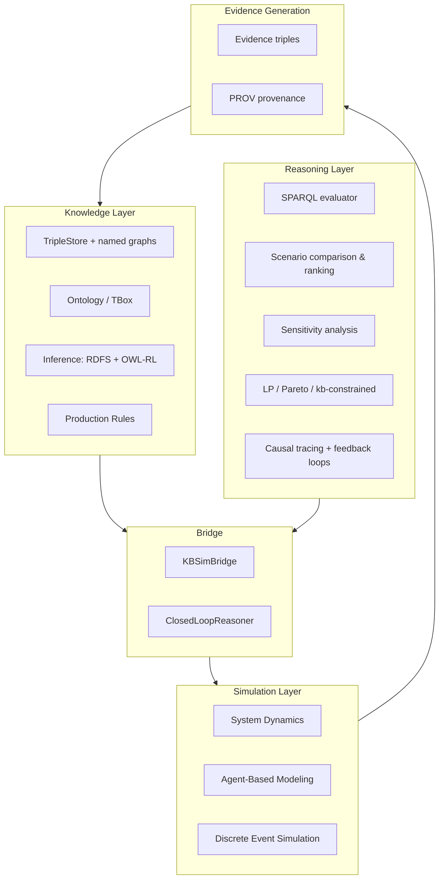
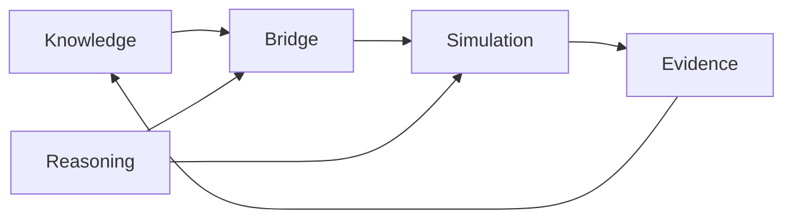

# Architecture

DynaFX is organized as a **knowledge-driven pipeline** with a clear data-flow: knowledge and reasoning live on one side, simulation on the other, connected by a bridge, with the loop closing through evidence.

## The Layered Pipeline

The cycle: **Knowledge Layer → Reasoning Layer → Bridge → Simulation Layer → Evidence Generation → Knowledge Update.** The knowledge graph is not a passive input; it is both read (to parameterize and steer the simulation) and written (as evidence), so the twin's knowledge grows with every run.

---

## Component Responsibilities

### 1. Knowledge Layer (`dynafx/knowledge`)

The **memory and semantics** of the twin.

- **`TripleStore`** — in-memory RDF store with SPO/POS/OSP indices, named graphs, and all 8 triple patterns. Facts are stored per source graph, preserving provenance.
- **Ontology / TBox** — class and property hierarchies (`TypeHierarchy`, `TBox`, `load_tbox`).
- **Inference** — forward-chaining `RuleEngine` with `rdfs_rules()` (7 rules) and `owl_rl_rules()` (4 rules), applied to a fixpoint.
- **Production Rules** — condition→action engine over the store (`ProductionRuleEngine`), with 5 condition and 5 action types.

**Extension points:** new ontologies via Turtle + TBox definitions; new inference via `Rule` declarations; new behavior via production rules; new data sources via YAML ingestion mappings (`ingest_csv`).

### 2. Reasoning Layer (`dynafx/dynamics` analysis + `dynafx/knowledge/sparql`)

The **intelligence** that turns facts and model output into insight.

- **SPARQL** — query the union of named graphs (SELECT, ASK, DESCRIBE, FILTER, DISTINCT, LIMIT, OFFSET).
- **Scenario comparison** — run parameter sets, grade outcomes, rank, and filter by constraints (`ScenarioComparison`).
- **Sensitivity analysis** — uniform/normal/lognormal ensembles over parameters (`SensitivityAnalyzer`).
- **Optimization** — `lp_minimize`/`lp_maximize` (scipy linprog), `pareto_optimize`, `calibrate`, and KB-constrained variants (`kb_lp_minimize`, `kb_calibrate`) that read coefficients/bounds straight from SPARQL.
- **Causal analysis** — `causes_tree`, `effects_tree`, `causal_trace`, `causes_strip`; feedback-loop detection with polarity.

**Extension points:** new optimizers, new scenario graders, new sensitivity distributions, new causal analyses — all operating on `SysdModelResult` and the store.

### 3. Bridge (`dynafx/bridge.py`)

The **connective tissue** — three integration patterns:

1. *Pre-flight* — `KBSimBridge.params_from_kb` extracts KB facts into simulation parameters.
2. *Mid-flight* — `KB_QUERY` / `KB_ASSERT` builtins read and write the store every timestep during simulation.
3. *Post-flight* — `evidence_from_result` writes simulation results back as evidence triples; `record_provenance` writes PROV audit records.

`ClosedLoopReasoner` composes these into iterative **simulate → grade → nudge → re-simulate** cycles.

**Extension point:** the bridge is the single place to add new KB↔sim integration patterns (e.g., streaming updates, calibration loops).

### 4. Simulation Layer (`dynafx/dynamics` engines)

The **dynamics** — three paradigms on a shared state namespace.

- **System Dynamics** — `SysdModel` (Python API or `.sysd` DSL): stocks, flows, auxes, lookup tables, submodels, RK4/Euler, delays (SMOOTH, DELAY3, DELAYN, DELAY_FIXED, CONVEY_BATCH), time functions (PULSE, STEP, RAMP, NOISE), `~Unit~` checking.
- **Agent-Based Modeling** — `ABMEngine`: typed agents, rules (perceive→decide→act), topic-based `SEND`, `SWITCH_STRATEGY` with cooldown, meta-rules, 4-phase step cycle.
- **Discrete Event Simulation** — `DESEngine`: queues, resources, event-driven clock, utilization tracking.

SD, ABM, and DES write to the same state dict, so an aux can read an agent metric or a queue length, and a DES queue can be gated by an SD stock.

**Extension point:** the plugin registry (`dynafx/registry.py`) for custom builtins and DES hooks; custom paradigms can participate via the shared state contract.

### 5. Evidence Generation

The **learning** — simulation outcomes returned to knowledge.

- `evidence_from_result` writes outcome triples (revenue, cost, penalties, fill rate, risk) into an evidence graph.
- `record_provenance` attaches PROV run records, so every conclusion is traceable to a run, a model, and a parameter set.

---

## Dependency Direction

- **Knowledge → Bridge** — `KBSimBridge` reads facts (`params_from_kb`) and writes evidence.
- **Reasoning → Bridge** — scenarios/optimizers feed nudges through the bridge.
- **Bridge → Simulation** — resolved parameters and KB queries steer the run.
- **Simulation → Evidence** — results become evidence triples.
- **Evidence → Knowledge** — evidence lands in the store, closing the loop.

---

## Design Rationale

- **Named graphs per source** — each information source is its own graph; queries read the union. This preserves provenance without sacrificing a unified view.
- **In-memory store, zero external dependencies** — the RDF/SPARQL engine is self-contained, making DynaFX deployable and auditable anywhere.
- **CompiledSystem caching** — ASTs, code objects, and topological sorts are cached after the first `simulate()`, giving ~25x speedups for repeated runs (the norm in scenario/sensitivity/optimization work).
- **SPARQL aggregates pre-computed** — the evaluator has no GROUP BY; aggregate values are computed at ingest time and stored as explicit triples. Keeps the evaluator simple and the semantics explicit.
- **Shared state dict across paradigms** — SD/ABM/DES interoperation is a design principle, not an add-on.
- **Python API as the primary path** — models can be built and extended directly in Python; the `.sysd` DSL is a convenient surface for the same model.

For deeper technical rationale, see [Scientific Foundations](foundations.md).
