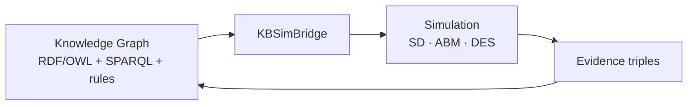

# DynaFX

> **DynaFX is a semantic simulation platform for building cognitive digital twins.**
>
> It unifies multi-paradigm simulation (System Dynamics, Agent-Based Modeling, and Discrete Event Simulation) with symbolic knowledge representation (RDF/OWL/SPARQL), enabling digital twins that reason over knowledge and continuously adapt through feedback.

---

## Why DynaFX Exists

Modern enterprises are not just physical systems; they are *knowledge systems*. Decisions are made against a backdrop of contracts, suppliers, risk facts, policies, and obligations — most of which live in documents and databases, not in differential equations. Classical simulation toolkits model the physics of a system but cannot read its knowledge. Classical knowledge engines can reason about facts but cannot *run the system forward in time*.

DynaFX exists to close that gap. It treats the knowledge base and the simulation as **one living system**: enterprise facts are ingested into a knowledge graph, a multi-paradigm simulation is steered by those facts, and the results flow back into the knowledge graph as evidence — which then triggers rules, optimization, and the next round of reasoning.

The result is a digital twin that does not merely mirror an asset. It **senses** its enterprise context, **learns** from every run, **foresees** the future through scenario analysis, and **acts** through policies and optimization. In the vocabulary of the Digital Twin Consortium, this is a *cognitive digital twin*: a twin that learns at run time, foresees the future, and acts accordingly.

---

## What Makes DynaFX Different

- **Model-based reasoning, not just data-driven ML.** Most "cognitive" digital twin work couples a twin to machine-learned anomaly/RUL models. DynaFX instead reasons with *explicit symbolic models*: RDF/OWL semantics, SPARQL queries, production rules, and causal structure — all auditable and reproducible. This is complementary to, and composable with, data-driven methods.
- **Three simulation paradigms under one roof.** System Dynamics (aggregate stocks and flows), Agent-Based Modeling (heterogeneous actors and strategies), and Discrete Event Simulation (queues, resources, schedules) share a single state namespace and run together in one model file. Each paradigm is right for a different kind of question; DynaFX lets you ask them all at once.
- **The knowledge graph is live, not decorative.** Simulation models execute `KB_QUERY` / `KB_ASSERT` builtins *mid-flight*: they read knowledge-graph facts each timestep and write observations back. The twin's dynamics are numerically steered by its ontology.
- **A closed learning loop.** `KBSimBridge` extracts KB facts into parameters, the simulation runs, and results return as evidence triples. `ClosedLoopReasoner` drives simulate → grade → nudge → re-simulate cycles until targets are met.
- **A research platform, not an appliance.** Everything is a Python API with extension points — custom builtins, a plugin registry, model factories, and a fully self-contained RDF/SPARQL engine with zero external dependencies.

---

## Architecture at a Glance



The same loop, in words: **Knowledge Graph → Bridge → Simulation → Evidence → Knowledge Update.**

---

## Main Capabilities

| Capability | What it does |
|------------|--------------|
| **System Dynamics** | Vensim-style `.sysd` DSL (or Python API): stocks, flows, auxes, lookup tables, submodels, RK4/Euler, SMOOTH/DELAY3/DELAYN/DELAY_FIXED/CONVEY_BATCH, PULSE/STEP/RAMP/NOISE, `~Unit~` checking. |
| **Agent-Based Modeling** | Typed agents, rule-based perceive→decide→act, topic-based message passing (`SEND`), strategy switching with cooldown (`SWITCH_STRATEGY`), meta-rules, 4-phase step cycle. |
| **Discrete Event Simulation** | Queues with capacity/service-time expressions, multi-server departure, resource pools, utilization tracking. |
| **Knowledge Graph** | Self-contained RDF model, `TripleStore` with named graphs, Turtle/N-Triples parse + serialize, RDFS (7 rules) and OWL-RL (4 rules) inference, TBox hierarchies. |
| **Semantic Queries** | SPARQL 1.1 parser/evaluator: SELECT, FILTER, DISTINCT, LIMIT, OFFSET, ASK, DESCRIBE. |
| **Bridge** | `KBSimBridge` — KB→parameter extraction, mid-flight `KB_QUERY`/`KB_ASSERT`, post-flight evidence triples, provenance recording. `ClosedLoopReasoner` for iterative sense→grade→nudge cycles. |
| **Analysis** | Causal tracing (`causes_strip`, `causal_trace`), feedback-loop detection, scenario comparison (tornado/deviation/summary), sensitivity ensembles, LP/Pareto optimization. |
| **Ingestion** | Declarative CSV→RDF via YAML mapping files; transactions; execution provenance. |

---

## Research Applications

DynaFX is designed to support published, reproducible research:

- **Cognitive digital twins** for supply chains, factories, grids, hospitals, buildings, and logistics networks.
- **Semantic simulation** — how symbolic knowledge (ontology, rules) and quantitative dynamics interact in a closed loop.
- **Multi-paradigm methodology** — when to use SD vs. ABM vs. DES, and how to couple them on shared state.
- **Decision and policy studies** — scenario grading, constraint-filtered ranking, and knowledge-graph-constrained LP mitigation.
- **Benchmarking and reproducibility** — every run is parameterized, seeded, and recorded with provenance triples.

See [Scientific Foundations](foundations.md) for the design rationale and [Open Research Problems](open-problems.md) for concrete problems we are looking to collaborate on.

---

## Quick Example

A minimal closed-loop digital twin: a knowledge graph fact steers a stock/flow model, and the result becomes an evidence triple.

```python
from dynafx.knowledge import TripleStore
from dynafx.knowledge.model import NamedNode, Literal, XSD_DOUBLE, Triple
from dynafx.dynamics import SysdModel, StockDef, FlowDef, AuxDef
from dynafx import KBSimBridge

epc = lambda x: NamedNode("http://epc.org/" + x)

# 1. Knowledge: supplier reliability is a KB fact.
store = TripleStore()
store.add(Triple(epc("Portfolio"), epc("aggregateSupplierReliability"),
                 Literal("0.82", datatype=XSD_DOUBLE)), "enterprise")

# 2. Simulation: an inventory model gated by that reliability.
model = SysdModel(
    stocks=[StockDef(name="Inventory", initial=1000, flows=[
        FlowDef(name="supply", direction="+", expr="desired * reliability"),
    ])],
    aux_vars=[AuxDef(name="desired", expr="500"),
              AuxDef(name="reliability", expr="kb_reliability")],
    dt=1.0,
)

# 3. Bridge: pull the KB fact into a parameter.
bridge = KBSimBridge(store)
params = bridge.params_from_kb([
    (epc("Portfolio"), epc("aggregateSupplierReliability"), None, "kb_reliability"),
])
result = model.simulate(params=params, method="euler", dt=1.0)
print(result.values["Inventory"][-1])
```

The flagship, fully-featured example — a solar EPC supply chain reasoning through a typhoon-induced port closure, spanning L1 (sense) to L5 (decide) — is covered in the [Digital Twin](digital-twin.md) walkthrough.

---

## Installation

```bash
git clone https://github.com/Achref-Yak/DynaFX.git
cd DynaFX
uv pip install -e ".[all]"       # or: pip install -e ".[all]"
```

Python 3.12+. Full documentation is hosted on GitHub Pages: <https://achref-yak.github.io/DynaFX/>.

---

## Getting Oriented

- **New here?** Read [Concepts](concepts.md) — the mental model, no code.
- **Researcher?** Read [Scientific Foundations](foundations.md) and [Open Research Problems](open-problems.md).
- **Builder?** Run the flagship [Digital Twin](digital-twin.md) and study the [Examples](examples.md).
- **Architect?** Read [Architecture](architecture.md).
- **Contributor?** See [Development](development.md) for setup, tests, and contribution paths.
