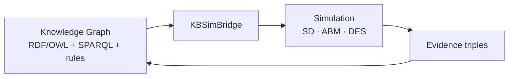

# DynaFX

Multi-paradigm simulation (**SD + ABM + DES**) with a knowledge-graph engine — RDF/OWL/SPARQL semantics, production rules, and closed-loop KB↔simulation reasoning for decision support.

---

## Why DynaFX Exists

Modern systems are not just physical; they are *knowledge systems*. Decisions are made against a backdrop of contracts, suppliers, risk facts, policies, and obligations — most of which live in documents and databases, not in differential equations. Classical simulation toolkits model the physics of a system but cannot read its knowledge. Classical knowledge engines can reason about facts but cannot *run the system forward in time*.

DynaFX exists to close that gap. It treats the knowledge base and the simulation as **one connected system**: enterprise facts are ingested into a knowledge graph, a multi-paradigm simulation is steered by those facts, and the results flow back into the knowledge graph as evidence — which then triggers rules, optimization, and the next round of reasoning.

---

## What Makes DynaFX Different

- **Model-based reasoning, not just data-driven ML.** Much "cognitive" work couples a model to machine-learned anomaly/RUL predictions. DynaFX instead reasons with *explicit symbolic models*: RDF/OWL semantics, SPARQL queries, production rules, and causal structure — all auditable and reproducible. This is complementary to, and composable with, data-driven methods.
- **Three simulation paradigms under one roof.** System Dynamics (aggregate stocks and flows), Agent-Based Modeling (heterogeneous actors and strategies), and Discrete Event Simulation (queues, resources, schedules) share a single state namespace and run together in one model file. Each paradigm is right for a different kind of question; DynaFX lets you ask them all at once.
- **The knowledge graph is live, not decorative.** Simulation models execute `KB_QUERY` / `KB_ASSERT` builtins *mid-flight*: they read knowledge-graph facts each timestep and write observations back. The model's dynamics are numerically steered by its ontology.
- **A closed learning loop.** `KBSimBridge` extracts KB facts into parameters, the simulation runs, and results return as evidence triples. `ClosedLoopReasoner` drives simulate → grade → nudge → re-simulate cycles until targets are met.
- **A research platform, not an appliance.** Everything is a Python API with extension points — custom builtins, a plugin registry, model factories, and a fully self-contained RDF/SPARQL engine with zero external dependencies.

---

## Architecture at a Glance



### Simulate a model

```python
from dynafx.knowledge import TripleStore
from dynafx.knowledge.model import NamedNode, Literal, XSD_DOUBLE, Triple
from dynafx.dynamics import SysdModel, StockDef, FlowDef, AuxDef
from dynafx import KBSimBridge

epc = lambda x: NamedNode("http://epc.org/" + x)

# 1. Knowledge: supplier reliability is a KB fact.
store = TripleStore()
store.add(Triple(epc("Portfolio"), epc("aggregateSupplierReliability"),
                 Literal("0.82", datatype=XSD_DOUBLE)), "enterprise")

# 2. Simulation: an inventory model gated by that reliability.
model = SysdModel(
    stocks=[StockDef(name="Inventory", initial=1000, flows=[
        FlowDef(name="supply", direction="+", expr="desired * reliability"),
    ])],
    aux_vars=[AuxDef(name="desired", expr="500"),
              AuxDef(name="reliability", expr="kb_reliability")],
    dt=1.0,
)

# 3. Bridge: pull the KB fact into a parameter.
bridge = KBSimBridge(store)
params = bridge.params_from_kb([
    (epc("Portfolio"), epc("aggregateSupplierReliability"), None, "kb_reliability"),
])
result = model.simulate(params=params, method="euler", dt=1.0)
print(result.values["Inventory"][-1])
```

### Grade a knowledge graph against a target

```python
from dynafx import parse_turtle, grade_queries

store = parse_turtle("""
    @prefix ex: <http://ex.org/> .
    ex:portfolio ex:revenue 950.0 .
""")

query = "PREFIX ex: <http://ex.org/> SELECT ?v WHERE { ex:portfolio ex:revenue ?v }"
grades = grade_queries([(query, "v", 0.5, 0.0)], store)
print(grades)   # {'0': 1.0} — score in [0, 1]
```

## Features

| Paradigm | Description |
|----------|-------------|
| **System Dynamics** | Stock/flow models, Vensim-style DSL, RK4/Euler integration, submodels, unit checking |
| **Knowledge Engine** | RDF triple store, SPARQL, RDFS/OWL inference, production rules |
| **Agent-Based** | Strategies, rules, message passing, strategy switching with cooldown |
| **Discrete Event** | Queues, resources, event-driven simulation, DES clock |
| **Knowledge Bridge** | `KB_QUERY` / `KB_ASSERT` in simulation — models query and update the knowledge graph at runtime |

## Installation

```bash
git clone https://github.com/Achref-Yak/DynaFX.git
cd DynaFX
uv pip install -e ".[all]"       # or: pip install -e ".[all]"
```

Python 3.12+. Full documentation is hosted on GitHub Pages: <https://achref-yak.github.io/DynaFX/>.

---

## Getting Oriented

- `examples/global_solar_epc.py` — **Flagship example:** 7 EPC CSVs → knowledge graph → KB-steered SD+ABM+DES model → evidence round-trip → scenario grading → production rules → LP optimization → causal analysis. See the [case study](case-study-solar-epc.md).
- The `.sysd` model library lives in `data/models/` (see [Examples](examples.md)).
