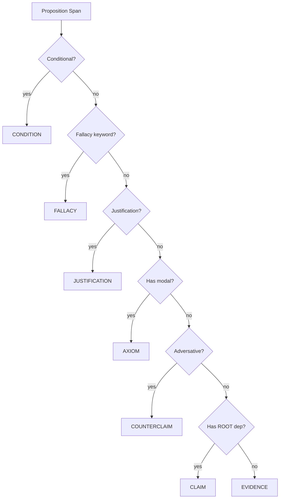

# Pipeline

The pipeline is the heart of the engine. This page describes each stage in detail, from raw text to structured graph.

## 1. Chunking (`chunker.py`)

Long documents are split into overlapping token windows to fit within the 512-token limit of the underlying transformer tokenizer.

```python
from cognitive_engine.chunker import chunk_text
from transformers import AutoTokenizer

tokenizer = AutoTokenizer.from_pretrained("distilroberta-base")
chunks = chunk_text(text, tokenizer, max_tokens=512, overlap=128)
```

Each `Chunk` records its character offsets, token IDs, and offset mapping for later reconstruction.

| Parameter | Default | Description |
|-----------|---------|-------------|
| `max_tokens` | 512 | Tokens per sliding window |
| `overlap` | 128 | Overlap between adjacent windows |

## 2. Preprocessing (`preprocessor.py`)

Each chunk is processed with spaCy `en_core_web_trf` for tokenization, POS tagging, dependency parsing, and named entity recognition.

A lightweight rule-based coreference resolver replaces pronouns with their most likely antecedents:

- **Subject pronouns** (he/she/it/they) → preceding NOUN or PROPN
- **Possessive pronouns** (his/her/its/their) → preceding NOUN or PROPN
- **Demonstratives** (this/that/these/those) → preceding clause root
- Gender/plurality matching narrows candidate search

The output is a `PreprocessedChunk` containing the original text, the coreference-resolved text, the spaCy `Doc`, and a list of coreference chains.

## 3. Sentence Detection (`tagger.py` — SentenceTagger)

Propositions are extracted as sentence boundaries from the spaCy `Doc.sents` iterator. Duplicate spans across overlapping chunk boundaries are deduplicated by character range.

This is the **default** tagger. The legacy `PropositionTagger` (RoBERTa token classifier trained on UKP data) can be used by passing it explicitly to `pipeline.run()`.

## 4. Relation Classification (`tagger.py` — RelationClassifier)

Every pair of propositions `(A, B)` is classified as one of:

| Label | Meaning |
|-------|---------|
| `Support` | A provides evidence or support for B |
| `Attack` | A contradicts or attacks B |
| `None` | No discursive relation |

The classifier is a fine-tuned DistilRoBERTa model trained on the UKP Sentential Argument Reasoning dataset. Only non-`None` pairs become edges in the graph.

## 5. Type Mapping (`type_mapper.py`)

Each proposition span is assigned a `NodeType` through a priority-ordered rule cascade:



Detection signals used:

| Type | Signal | Examples |
|------|--------|---------|
| CONDITION | `if`/`unless`/`provided` as subordinating conjunction | "If the token expires..." |
| FALLACY | Keyword match | "misleading", "flawed", "fallacy" |
| JUSTIFICATION | `because`/`since`/`for` as subordinating conjunction | "Because the system failed..." |
| AXIOM | Modal verb (must/should/could/will) | "The system must handle..." |
| COUNTERCLAIM | Adversative (but/however/nevertheless) | "However, the latency increased." |
| CLAIM | Root dependency, no other marker | "The system provides a framework." |
| EVIDENCE | Non-root clause, no markers | "(shows that) 70% of calls originate..." |

## 6. Demarcation Rules (`demarcation_rules.py`)

Every node is annotated with five cognitive-linguistic dimensions stored in `node.metadata["demarcation"]`:

| Dimension | Values | Logic |
|-----------|--------|-------|
| `cognitive_vs_epistemic` | COGNITIVE / EPISTEMIC / NA | Based on NodeType (EVIDENCE/JUSTIFICATION → EPISTEMIC, CONDITION → COGNITIVE) |
| `epistemic_vs_institutional` | EPISTEMIC / INSTITUTIONAL / NA | Modal verb head is stative → EPISTEMIC, else INSTITUTIONAL |
| `affect_vs_cognition` | AFFECT / COGNITION / NA | Sentiment adjective in span → AFFECT |
| `constraint_vs_enablement` | CONSTRAINT / ENABLEMENT / NA | Negated modal or constraint verb → CONSTRAINT, enablement verb → ENABLEMENT |
| `synchronic_vs_diachronic` | SYNCHRONIC / DIACHRONIC / NA | Present tense → SYNCHRONIC, past/future → DIACHRONIC |

## 7. Edge Assignment (`edge_assigner.py`)

Undirected classifier relations are resolved to directed `Edge` objects using a 3D lookup table `(source_type, target_type, label) → EdgeType` with 50+ entries.

The resolution tries both orderings `(A, B)` and `(B, A)` against the table. Default fallbacks:
- Unmapped `Support` → `SUPPORTS`
- Unmapped `Attack` → `CONTRADICTS`

A demarcation-based refinement rule converts `SUPPORTS` to `QUALIFIES` when the source node is INSTITUTIONAL and the target is EPISTEMIC.
